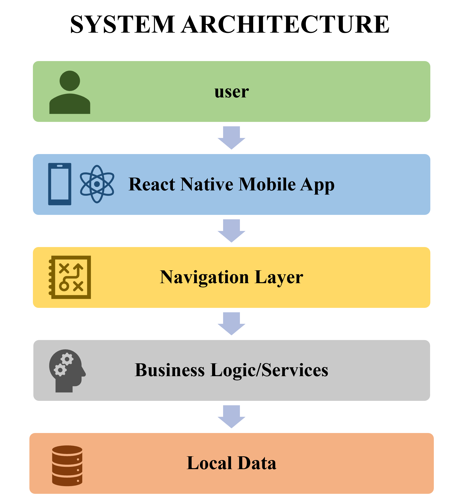
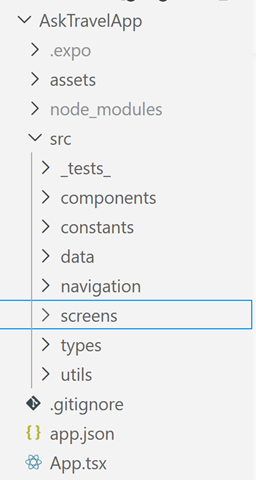
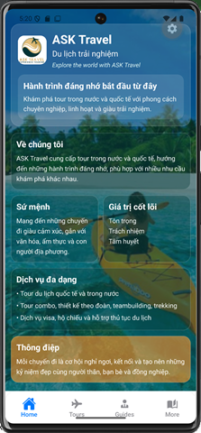
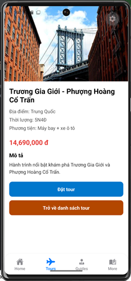
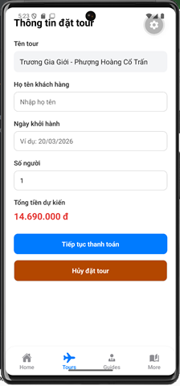
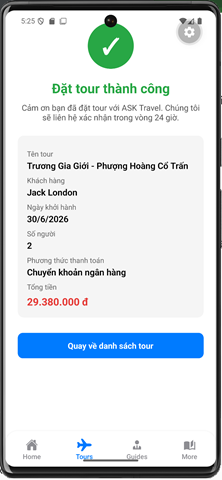

# ASK Travel Mobile App

This project is a mobile application developed using **React Native with Expo**.

The application allows users to explore travel tours and make tour bookings.

---

## Main Features

- View list of travel tours
- Search tours by keyword
- View tour details
- Book a tour
- Display booking confirmation screen

---

## Technology Stack

- React Native
- Expo
- TypeScript
- React Navigation

---

## System Architecture

The application follows a layered architecture.

User → Mobile App UI → Navigation → Business Logic → Local Data

  

---
## Project Structure

The project source code is organized into modular folders.

  

---

## Application Screenshots

### Home Screen

### Tour Detail Screen

### Booking Screen

### Booking Success Screen

---

## Installation

Clone the repository:
git clone https://github.com/TruongQuangCam/AskTravelApp

Install dependencies:
npm install

Start the project:
npx expo start

---

## Author

Cam Truong Quang  
Hoa Sen University

